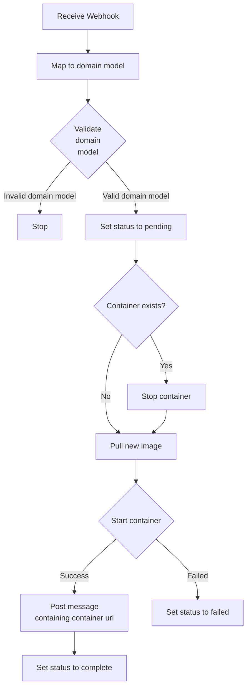

# Architecture

The file contains information on how the application works.

## Flow Diagram

```mermaid
  flowchart TD;
      A[Receive Webhook]-->B[Map to domain model]
      B-->C{Validate\n domain\n model}
      C-- Invalid domain model --> D[Stop]
      C-- Valid domain model --> E[Set status to pending]
      E-->F{Container exists?}
      F-- Yes --> G[Stop container]
      F-- No -->H
      G-->H[Pull new image]
      H-->I{Start container}
      I-- Success -->J[Post message \n containing container url]
      J-->K[Set status to complete]
      I-- Failed -->L[Set status to failed]
```